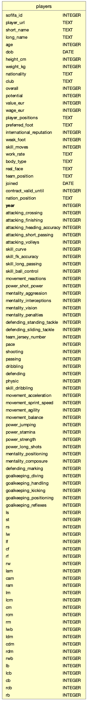
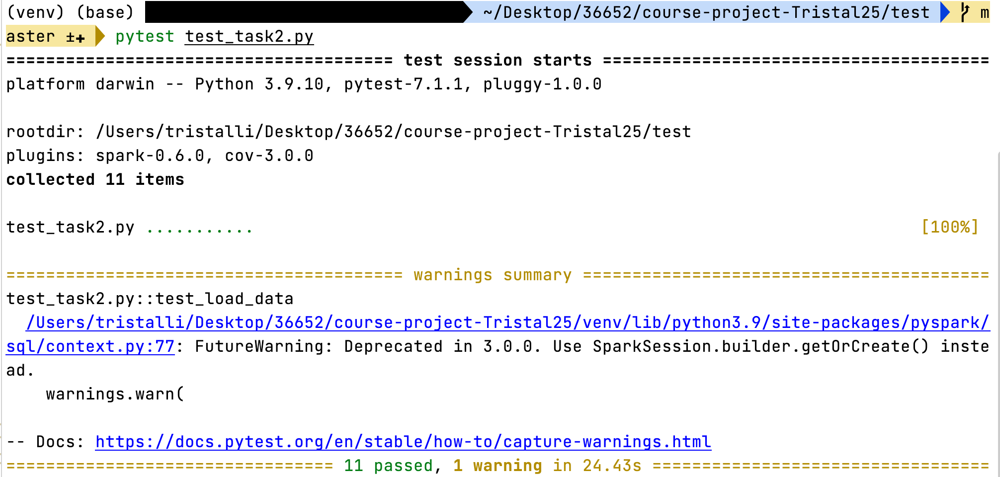
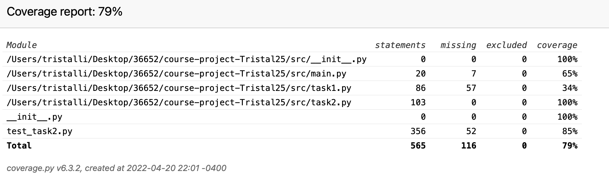

 
# Soccer players (2015-2020) analysis project repository

**The link to the video is:?**

## Task I: Build and populate necessary tables

**All the codes needed in this task are contained in src/task1.py**

Here is the infrastructure of the table: 



**Constraints:**
1. ```sofifa_id``` is the primary key of this dataset, and is an integer
2. ```dob```, ```joined``` are dates, and ```contract_valid_until``` is a four digit integer for a year. 
3. ```overall```, ```potential```, ```attacking_crossing``` to ```defending_sliding_tackle```, ```pace``` to ```goalkeeping_reflexes```, and ```ls``` to ```rb``` are integer scores with range 0-100 (mainly two digits scores)
4. ```international_reputation```, ```weak_foot```, and ```skill_moves``` are integer scores with range 1-5. 
5. ```prefered_foot```, ```real_face``` are binary characters with levels left/right and yes/no respectively. 
6. ```value_eur```, ```wage_eur```, and ```release_clause_eur``` are integer representing money in euros. 
7. ```height_cm``` are three digits integers, and ```weight_kg``` are two to three digits integers. 

## Task II: Conduct analytics on your dataset 

**All the codes needed in this task are contained in src/task2.py**

1. List the x players who achieved highest improvement across all skillsets. The steps are:
    - Overall skill scores are calculated by aggregated values of 40 rows: ```attacking_crossing``` to ```defending_sliding_tackle```, ```pace``` to ```goalkeeping_reflexes```. 
    - The improvement is overall skill scores in 2020 minus the overall skill scores in 2015. 
    - Choose the players with top x improvement scores.\

   **Input**:
   1. ```players```: the dataset players
   2. ```x```: the number of players to output
   
   **Output**: a list of full names of players with top x improvements
      
2. List the y clubs that have largest number of players with contracts ending in 2021. \
    **Input**: 
   1. ```players```: the dataset players
   2. ```y```: the number of clubs to output
   3. ```year```: the year of data to be used (2015-2020) in integer

   **Output**: list of the required club names
   
3. List the z clubs with largest number of players in the dataset where ```z``` >= 5.\
    **Input**: 
   1. ```players```: the dataset players
   2. ```z```: the number of clubs to output
   3. ```year```: the year of data to be used (2015-2020) in integer
   
   **Output**: list of the required club names

4. Get the most popular ```nation_position``` and ```team_position``` in the dataset\
    **Input**: 
   1. ```players```: the dataset players
   3. ```year```: the year of data to be used (2015-2020) in integer, or `````"all"````` for all the years
    
   **Output**: a dictionary with:
   - ```nation```: most popular ```nation_position```, and 
   - ```team```: most popular ```team_position```
    
5. Get the most popular nationality for the players in the dataset\
    **Input**: 
   1. ```players```: the dataset players
   2. ```year```: the year of data to be used (2015-2020) in integer, or `````"all"````` for all the years
    
   **Output**: A string containing the required nationality

## Task III Test your Code and Document it

In this part, we did unit tests on the functions in Task II using the ```pytest-spark``` package. 
The covered scenarios are: 

1. Test ```init_db()```:
    - Test whether the table has been created
    - Test the columns (names and types)
    - Test whether the number of rows align with our record
    
2. Test ```top_players()```:
    - **Happy case**: 
        * The return value is not None for a valid input. 
        * Test answer for all possible ```x```
    - **Sad case**: 
      1. Invalid input for ```x```, TypeError should be reported. The inputs are: 
           * None
           * String
           * Non-integer
           * Negative value
           * Zero
      2. Invalid input for ```players```, TypeError should be reported. The inputs are: 
           * List
           * String
           * Integer
      3. ```x``` larger than the number of clubs, expect output of all the clubs
         
3. Test ```largest_club_2021()```:
    - **Happy case**: 
        * The return value is not None for a valid input. 
        * Test answer for all possible ```y```
        * Test answer for all possible ```year```
    - **Sad case**: 
      1. Invalid input for ```y```, TypeError should be reported. The inputs are: 
           * None
           * String
           * Non-integer
           * Negative value
           * Zero
      2. Invalid input for ```year```, TypeError should be reported. The inputs are: 
           * None
           * String
           * Non-integer
           * Negative value
           * Values not in 2015-2020 range
      3. Invalid input for ```players```, TypeError should be reported. The inputs are: 
           * List
           * String
           * Integer
      4. ```y``` larger than the number of clubs, expect output of all the clubs
         
4. Test ```largest_club()```:
    - **Happy case**: 
        * The return value is not None for a valid input. 
        * Test answer for all possible ```z```
        * Test answer for all possible ```year```
    - **Sad case**: 
      1. Invalid input for ```z```, TypeError should be reported. The inputs are: 
           * None
           * String
           * Non-integer
           * Negative value
           * Zero
           * Integer between 0-4
      2. Invalid input for ```year```, TypeError should be reported. The inputs are: 
           * None
           * String
           * Non-integer
           * Negative value
           * Values not in 2015-2020 range
      3. Invalid input for ```players```, TypeError should be reported. The inputs are: 
           * List
           * String
           * Integer
      4. ```z``` larger than the number of clubs, expect output of all the clubs
    
5. Test ```popular_nation_team()```, ```popular_nationality()```
     - **Happy case**: 
        * The return value is not None for a valid input.
        * Test answer for all possible ```year```
    - **Sad case**:
      1. Invalid input for ```year```, TypeError should be reported. The inputs are: 
           * None
           * String
           * Non-integer
           * Negative value
           * Values not in 2015-2020 range
      2. Invalid input for ```players```, TypeError should be reported. The inputs are: 
           * List
           * String
           * Integer
      3. The most popular target value in ```player``` is None

Here is the unit test result. All the tests were passed. 


The unittest cover 100% of the task2 codes. Here is the screenshot of the coverage report. 


For the full coverage report, see test/htmlcov/index.html. 


    